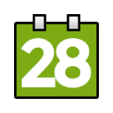

# WEEK

This is a Chrome extension, and is the quickest way to find out what week number it is.

You can find it in the [Chrome web store](https://chrome.google.com/webstore/detail/week/ibbkfijlikhkenbcdlkackfjfbcakdon).

Any issues can be repported [here](https://github.com/Lavve/week/issues) or in the support section in Chrome web store.